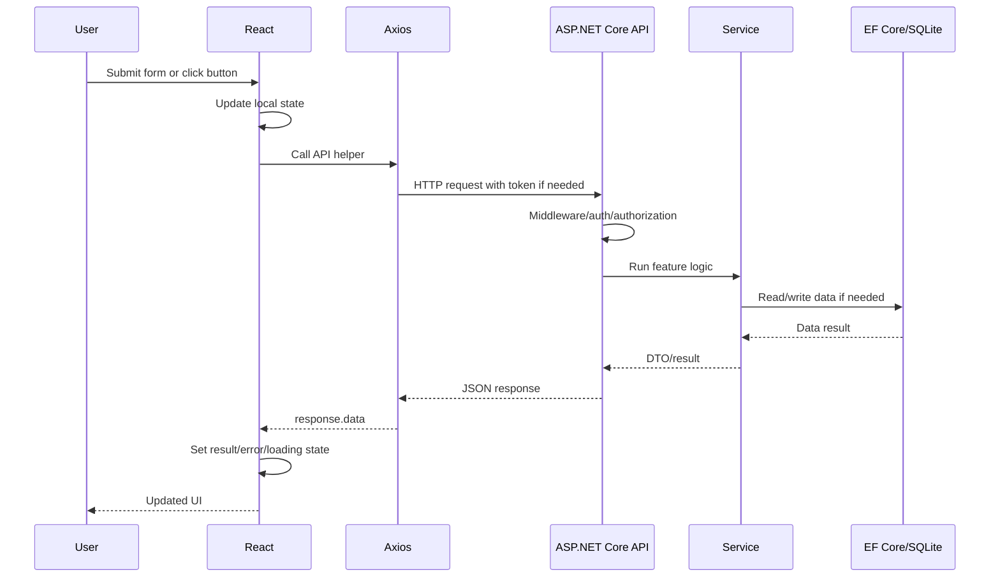

# End-to-End Request Flow

This is the general full-stack request flow in Madai.

## General Flow

1. User interacts with React UI.
2. React component updates local state.
3. Frontend API helper sends Axios request.
4. Axios applies base URL and bearer token if needed.
5. ASP.NET Core receives the request.
6. Middleware runs.
7. Authentication and authorization run if the endpoint is protected.
8. Controller receives request DTO, query params, or form-data.
9. Service handles business logic or external provider logic.
10. EF Core reads/writes database data if needed.
11. Controller returns response DTO.
12. React receives response.
13. UI updates loading, error, empty, or result state.

## Text Diagram

```text
React page
  -> local state
  -> api helper
  -> shared Axios client
  -> ASP.NET Core middleware
  -> controller
  -> service
  -> EF Core / external provider
  -> DTO response
  -> React state update
  -> UI re-render
```

## Mermaid Overview



## Login Flow

```text
Login.jsx
  -> login(email, password)
  -> POST /api/auth/signin
  -> AuthController.SignIn
  -> AuthService.SignIn
  -> BCrypt verifies password
  -> JwtService creates token
  -> SignInResponseDTO
  -> saveAuthUser()
  -> navigate to protected flow
```

## Profile Flow

```text
Profile.jsx useEffect
  -> getMyProfile()
  -> Axios adds bearer token
  -> GET /api/user/me
  -> JWT validates token
  -> UserController.GetMyProfile
  -> EF Core loads user
  -> UserProfileDTO
  -> Profile.jsx updates form state
```

## Symptom Checker Flow

```text
SymptomChecker.jsx
  -> checkSymptoms(...)
  -> POST /api/SymptomChecker
  -> SymptomCheckerController
  -> EF Core saves SymptomEntry
  -> SymptomService AI/demo analysis
  -> EF Core saves AnalysisResult
  -> AnalysisResultDTO
  -> UI shows demo result
```

## Doctor Search Flow

```text
DoctorSearch.jsx
  -> searchDoctors(location, specialty)
  -> GET /api/Doctors/search
  -> DoctorsController
  -> DoctorService
  -> Google Places if configured, fictional demo doctors otherwise
  -> List<DoctorDto>
  -> UI renders result cards
```

## Report Upload Flow

```text
MedicalHistory.jsx
  -> validate PDF and size
  -> uploadMedicalReport({ patientName, file })
  -> FormData multipart request
  -> POST /api/MedicalReport/upload-report
  -> MedicalReportController validates auth/PDF/size
  -> MedicalReportService PDF analysis or demo fallback
  -> EF Core stores metadata and analysis only
  -> MedicalReportSummaryDTO
  -> UI shows success and report card
```
